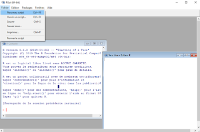

```{r setup, include=FALSE}
knitr::opts_chunk$set(echo = FALSE)
```


## Objectifs

- Maitriser la grammaire de base du langage R.


- Comprendre le fonctionnement et l'utilisation de fonctions de base et de leurs arguments.


- Définir et manipuler différents types d'objets avec des opérateurs.


- Importer et manipuler un jeu de données


- Explorer certaines fonctions de statistiques descriptives, d'analyse et de graphiques de base.

<br>

## Contenu des capsules de formation


- **Première capsule**: Entrée en matière - Pourquoi R? 


- **Capsule deux**: Introduction au langage R (objets, fonctions et arguments)


- **Capsule trois**: Importation et exploration d'un tableau de données


- **Capsule quatre**: L'indexation (sélection de variables et création de sous-groupes)


- **Capsule cinq**: La manipulation de variables qualitatives et quantitatives (renommer, recoder...)


- **Capsule six**: Les statistiques descriptives


- **Capsule sept**: Les tests statistiques de base


- **Capsule huit**: Les graphiques univariés et bivariés

<br>

## 1. Pourquoi **R**? 


- Langage et interface de programmation libres et gratuits pour l’analyse statistique et graphique (etc.).
- Multiplateforme : Windows, Mac, Linux.
- Très fort pour les graphiques et visualisations de toutes sortes.
- Communauté très active donc développement constant = rapidité de l’implémentation de nouvelles méthodes (non disponibles dans les logiciels commerciaux).
- Pour tous les types d’analyses (modèles linéaires, multi-niveaux, analyses factorielles, équation structurelle, simulations, psychométrie, économétrie, génomique...).
- Utilisation de scripts assure la reproductibilité des analyses.
- Très efficace pour la création de présentations et de rapports (`Rmarkdown`, `knitr`, `LaTeX`)
- Excellente intégration avec de nombreux systèmes de bases de données,  autres langages et outils comme Colab ou Jupyter notebook (en association avec Python).

<br>

## 2. Quelques bémols  

- Plus un langage de programmation qu’un logiciel.
- Ne manipule pas directement les données comme SPSS ou excel, les fichiers de données sont des objets en mémoire.
- L’affichage des résultats est assez minimaliste.
- Prolifération des fonctions (*packages*) peut alourdir l’apprentissage.
- Développement rapide fait que la documentation laisse parfois à désirer.
- Contient généralement de l’aide pour toutes les fonctions mais pas toujours facile à comprendre.
- Comme pour tout language de programmation, un "rien" peut faire en sorte que le code plante.

<br>

## 3. R, RStudio et autres interfaces...  

- Interface du **R** de base pas très intuitive donc peu utilisée telle quelle  

<center>



</center>  

- Installe généralement en plus un IDE,  *Integrated Development Environment*, comme [**RStudio**](https://www.rstudio.com/products/rstudio/download/#download) :  éditeur de script - environnement beaucoup plus convivial qui facilite le travail (gestion des fichiers, objets et commandes, historique de fonctions, autocomplétion,…)
- **Sans aucune installation nécessaire, Colab fonctionne un peu comme un IDE en ligne, dans lequel on peut utiliser le langage R comme dans R ou RStudio**.


<br>

## 4. Installation  

1. Télécharger et installer [**R de base**](https://cran.r-project.org/) - choisir son système d’exploitation et suivre les étapes.

2. Télécharger et installer  [**RStudio**](https://www.rstudio.com/products/rstudio/download/#download) (ou autre interface) – Choisir la version gratuite et son système d’exploitation - des interfaces graphiques sont aussi disponibles, mais peu recommandées ([R Commander](https://www.rcommander.com/), [BlueSky Statistics](https://www.blueskystatistics.com/) )

3. Télécharger et installer ("charger") des *packages* dans **RStudio**.

<br>


### Avantage de travailler dans Colab!


 

[xkcd](https://xkcd.com/)

<br>

## 5. Qu’est-ce qu’un *package*? 

<br>

- Un *package* est un module (ou extension, librairie, bibliothèque) qui contient un ensemble de fonctions (souvent liées à une méthode ou un domaine particulier).
- À l’installation, **R** vient avec un ensemble de fonctions de base {base} et de modules par défaut (*built in packages*).
- Des *packages* composés de fonctions spécialisées sont constamment développés par la communauté.
- On en trouve plus de 15 000 sur le site officiel de **R** [CRAN](https://cran.r-project.org/web/packages/). D'autres se trouvent aussi ailleurs (Github, …).
- Les packages doivent être **téléchargés**(`install.packages()`) une seule fois, mais **chargés** (`library()` ou `require()`) à chaque session.

- **Dans Colab, tous les packages sont téléchargés dans l'environnement d'exécution sur le nuage, c'est pourquoi il faut les télécharger à chaque exécution (code généralement contenu la première cellule de notre fichier)**
    
<br>

<br>

- Les modules sont généralement évalués par les pairs - [Journal of Statistical Software](https://www.jstatsoft.org/index) – le choix doit se faire avec précautions.

- Comment les trouver et les choisir? En cherchant sur Google! En s’informant dans son domaine et en vérifiant si les packages ont déjà été utilisés dans des publications.

- Des fonctions effectuant les mêmes "tâches" prédéfinies (ex: corrélation, tableaux contingences…) peuvent se retrouver dans plusieurs packages avec variantes plus ou moins importantes (procédures, options, arguments, résultats).

- Il y a toujours plusieurs façons d’arriver au même résultat -> normal et nécessaire de se limiter à certaines fonctions.

- Certains packages ont des façons spécifiques de fonctionner. Ils utilisent une syntaxe et des formats qui se distinguent de la syntaxe commune de **R**. 


<br>

## 6. Tidyverse {.smaller}
 <center>


</center>  

- Ensemble de packages très utilisé spécialisé dans l’analyse, la manipulation et la visualisation de données -> repose sur le principe de  [*tidy data*](https://www.jstatsoft.org/article/view/v059i10).
- Les packages Tidyverse partagent une syntaxe commune et des "verbes" et opérateurs spécifiques (ex: %>%). 
- Travaillent avec un format de jeu de données particulier (*tibble*) – variation sur le dataframe.
- La commande `install.packages("tidyverse")` va télécharger toutes les extensions constituants le cœur de tidyverse. La fonction library(tidyverse) les chargera (Certains autres modules doivent être chargés individuellement) :
    + dplyr (manipulation des données)
    + tidyr (remise en forme des données)
    + purrr (programmation)
    + readr (importation de données)
    + tibble (tableaux de données)
    + forcats (variables qualitatives)
    + stringr (chaînes de caractères)
    + ggplot2 (visualisation)

- Voir [R for data science](https://r4ds.had.co.nz/index.html) de Grolemund & Wickham


<br>

## 7. **R**: Langage de programmation  

- **R** est avant tout un langage de programmation orienté objet.
- Développé à partir du **langage S** par *Ross Ihaka* et *Robert Gentleman* au cours des années ‘90.
- Permet de programmer ses propres fonctions et packages.  

<center>


</center>  


<br>


**Particularités à savoir**:

- Sensible à la casse (attention minuscules/majuscules)
- Sensible aux accents (éviter d’utiliser).
- Sensible aux signes de ponctuation: point pour décimales, virgule pour adressage.
- Non sensible aux espaces.
- Attention aux guillemets (pour texte, simple ou double), crochets, accolades, parenthèses.
- Une ligne par commande, ou séparer plusieurs commandes par ;.
- Importance fondamentale de documenter son code avec  # 
`# ceci est un commentaire (peut ajouter section en suivant avec au moins 4 ----)`
    + À noter que dans Collab, on peut créer des commentaires avec un # à l’intérieur d'une cellule de code ou utiliser des cellules de texte.
- Contrairement aux autres logiciels, l’analyse se fait par une série d’étapes avec des résultats intermédiaires stockés dans des objets.
  