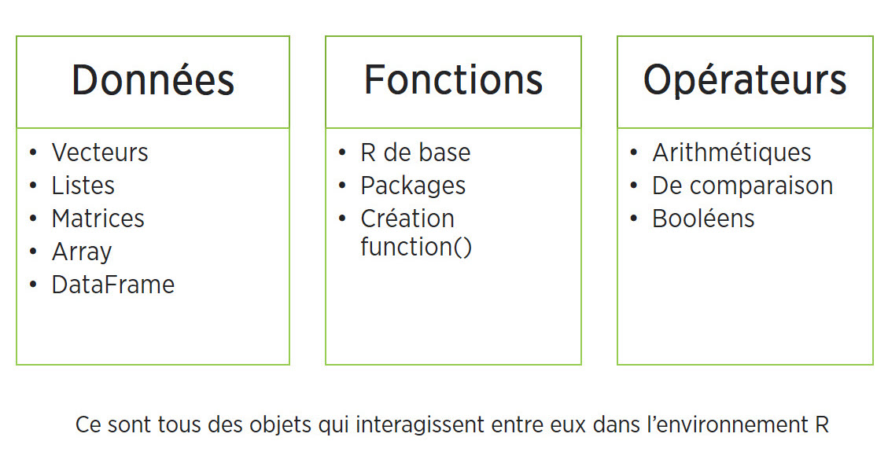
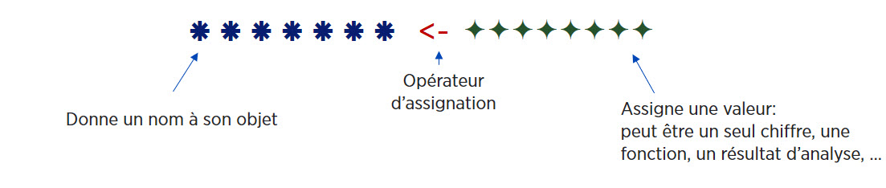
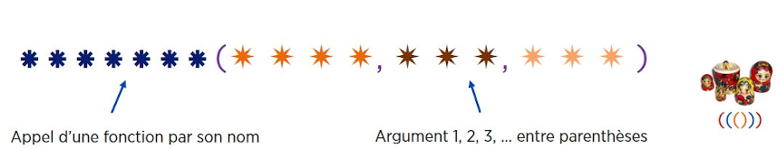

```{r setup, include=FALSE}
knitr::opts_chunk$set(echo = TRUE)
```

## Télécharger et charger les packages utilisés

```{r, eval=FALSE}
# Toujours débuter son script par le code d'installation des packages nécessaires.

# Dans Colab, tous les packages sont téléchargés dans l'environnement d'exécution sur le nuage, 
# c'est pourquoi il faut les télécharger et les charger à chaque fois.

# Cette étape peut prendre plusieurs minutes.

# À NOTER, puisque qu'il est préférable de ne pas inclure le code de téléchargement 
# des modules dans un document Rmarkdown, seuls les codes de chargement ont été indiqués:
library("questionr")

# Les commandes de téléchargement devront donc être ajoutées à son document Colab ou Rmarkdown:
install.packages("package", dependencies=TRUE)

# dependencies=TRUE: assure que tous les modules dépendants nécessaires seront aussi installés.
```

<br>

## Gestion de packages

```{r, eval=FALSE}
## Voir les modules téléchargés (chargés ou non)
installed.packages()	
```

```{r, eval=FALSE}
## Voir les modules chargés
search()
```

```{r, eval=FALSE}
## Lister les fonctions d'un module chargé
library(help = questionr)
```

```{r, eval=FALSE}
## Détacher un module chargé
detach(package:NomModule)     # pour éviter les conflits entre fonctions du même nom
```

<br>

# 1. Les objets

<center>



</center>  

```{r}
# R comme une grosse calculatrice

2+2
```

* Mais l’intérêt du langage est que l’on stocke les valeurs, résultats, les tableaux, fonctions, … dans des *objets* qui pourront être réutilisés dans d’autres objets, fonctions, analyses.

<center>



</center>  

<div class="fold o">

```{r}
# Calcul simple
(12+15+20)/3 
```

```{r}
## Créer un objet en utilisant l'opérateur d'assignation "<-" pour stocker le résultat du calcul
moyenne <- (12+15+20)/3 
```

```{r}
## Pour voir le contenu de son objet, tapper son nom

moyenne  # Utilisation implicite de la fonction print() 
```

Les noms d’objets:

- Peuvent contenir des chiffres, lettres et caractères _ et .
- Doivent commencer par une lettre, pas un chiffre.
- Ne pas utiliser d’accents ni d’espace.
- En principe il faut utiliser des noms significatifs, en pratique on utilise souvent des noms minimalistes pour faciliter la réutilisation.
- Certains noms courts sont réservés (max, min, c, q, t, …).

<br>

**Un objet est donc une boite dans laquelle on peut placer un chiffre, un mot, un jeu de données d'un million de répondants, une fonction, un graphique...**

<br>

<center>


</center>

# 2. Les opérateurs

*  Opérateurs d'assignation: **<-**, = , ->
*  Opérateurs de sélection: [], [[]], $, :
*  Opérateurs booléen: !, &, |
*  Opérateurs arithmétiques: +, -, *, /, ^
*  Opérateurs de comparaison: ==, !=, <, >, <=, >= 

<br>

# 3. Les fonctions

*  Permettent d’effectuer des tâches prédéfinies comme des analyses, graphiques, calculs, … 
*  Chaque fonction a un nom et plusieurs fonctions peuvent permettre d'effectuer la même tâche: Par exemple pour faire une correlation, on retrouve les fonctions cor(), cor.test(), ...
*  On appel une fonction en la nommant et on contrôle son comportement en paramétrant ses arguments
*  On peut imbriquer les fonctions les unes dans les autres avec des parenthèses.

<center>



</center>

```{r}
# Créer un nouvel objet nommé "age" composé d’une série de 5 nombres avec la fonction c() (combiner)
age <- c(12, 15, 20, 35, 40) 
```

```{r}
# Pour voir le nom d'un objet, on tappe son nom
age
```

```{r}
# Passer cet objet comme 1er argument de la fonction mean()
mean(age)
```

```{r}
# Arrondir le résultat sans décimale (argument digits=) en imbriquant la fonction mean() dans la fonction round()
round(mean(age), 0) 
```

<br>

# 4. Les arguments

* Chaque fonction possède une liste plus ou moins longue d’arguments (paramètres ou options) permettant de paramétrer son fonctionnement.
* Certains arguments ont une valeur par défaut. Si ces valeurs nous conviennent, pas besoin de les indiquer.
* Si l’argument n’a pas de valeur par défaut, FAUT le renseigner.
* Pour modifier la valeur d’un argument, on le nomme et change sa valeur à la suite d’un =.
* La liste d’arguments respecte un ordre. Si on modifie chaque argument dans l’ordre, on peut omettre le nom des arguments. Les arguments peuvent donc être nommés ou non nommés.
* Le premier argument, toujours les données (on ne le nomme généralement pas x=)
* Comment savoir quels sont les arguments d’une fonction? Taper Help(NomFonction) ou ?NomFonction .

```{r}
age <- c(25, 36, 47, 58, 69, NA)  # Je créé un vecteur composé de 5 chiffres et une valeur manquante

# À noter: lorsque l'on stocke un nouveau contenu dans un  objet existant, le contenu initial est écrasé
```

```{r}
mean(age)    # OUPS!
```

```{r, eval=FALSE}
help(mean)  # Pour afficher l'aide d'une fonction (ou ?mean)
```

```{r}
mean(age, na.rm=TRUE)

# L'argument na.rm=TRUE indique de ne pas prendre en compte les valeurs manquantes
# L'argument trim=.05 indique d'exclure les 5% les plus extrêmes
```

<br>

# 5. Les types d'objets

- Les objets sont caractérisés par **différentes structures**
- On retrouve **5 différents types de contenants** ayant chacun leurs propriétés 

1.   **Vecteur**
2.   Liste
3.   Matrice
4.   Arrays (3d)
5.   **Dataframe (tableaux)**

<center>


</center>

<br>

## 5.1. Vecteurs

Définition: 

*  La brique élémentaire = série de valeurs.
*  En pratique, c’est une variable (mais qui n’est pas dans un tableau) et ses éléments sont ses valeurs.
*  Objet contenant des valeurs (éléments/composantes) d'un seul **mode**: numérique, textuel, logique. 

```{r}
# On créer des vecteurs principalement avec la commande c()

poids <- c(70, 65, 60)  # vecteur numérique
sexe <- c("femme", "homme", "femme")  # vecteur textuel
taille <- c(TRUE, FALSE, FALSE, TRUE)  # vecteur booléen
```

```{r}
# Pour voir le "format" des éléments stockés dans un objet, utiliser la fonction mode() ou typeof()

mode(poids)
```

```{r}
# On peut faire des calculs entre vecteurs - ex. calcul de l'IMC: poids divisé par taille au carré 
poids <- c(70, 65, 60)
```

```{r}
taille <- c(1.45, 1.60, 1.70) ^ 2  
```

```{r}
IMC <- poids / taille 
```

```{r}
IMC
```

```{r}
median(IMC) # Passer l'objet IMC à la fonction de médiane
```

```{r}
IMC - mean(IMC) # Calculer la différence face à la moyenne
```

<br>

## 5.2. Facteurs 

* Définition: vecteur avec des attributs spécifiques, dont la structure correspond aux variables qualitatives.
* Les modalités de la variable correspondent à des "niveaux" (*levels*) uniques et fixes, ie impossible d’assigner une valeur qui n’a pas été préalablement définie comme une des modalités.
* Des étiquettes (*labels*) peuvent être associées aux niveaux.
* Lors de l’importation de données, tout dépendant de la fonction d'importation, les variables qualitatives seront importées sous forme de vecteur textuel ou de facteur.

```{r}
# Créer une variable de type facteur à partir d'un vecteur textuel de 5 valeurs de 2 niveaux avec la fonction factor()
sexe <- factor(c("H", "H", "F", "H"), labels = c("Homme", "Femme"))
```

```{r}
# L'objet est un facteur avec 2 modalités (niveaux) définis par défaut en fonction des valeurs fournies 
str(sexe)
```

<br>

## 5.3. Dataframes

*  Définition: Tableau de données pouvant regrouper des vecteurs de différents types (numériques et textuels)
* Structurellement, le dataframe est une **liste** composées de **vecteurs nommés** (noms de variables uniques) de même **longueur** (nombre d'observations) mais qui peuvent être de **modes différents** (variables numériques, textuelles)
* C'est donc un tableau avec des colonnes - `ncol()` et des lignes - `nrow()`,  donc 2 dimensions - `dim()`.
*  Crée un jeu de données avec la fonction data.frame(), mais on le crée rarement manuellement, généralement importé en format .txt, .csv, .spss ...

*  Par défaut, si on ne désactive pas l’option stringsAsFactors à la création d'un dataframe, les vecteurs textuels sont de type facteur

```{r}
# Créer un data frame avec 3 variables (2 vecteurs numériques et 1 vecteur textuel) avec la fonction data.frame()
age <- c(45,65,22,38,54,31,29,44,56,67) 
poids <- c(150,125,210,175,110,180,130,155,190,120)
sexe <- c("H","F","F","H","H","F","F","H","F","H")
bd <- data.frame(age, sexe, poids)
```

```{r}
bd 
```

</div>
