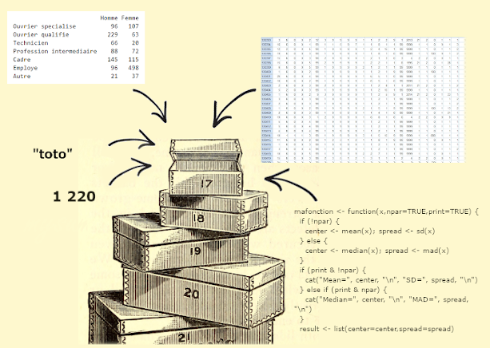

Caroline Patenaude <br> 
*[Bibliothécaire - Bibliothèque des lettres et sciences humaines](https://bib.umontreal.ca/guides/donnees-statistiques-geospatiales/donnees-statistiques)* 
<br>

[Script Colab](https://github.com/Cours-EDUlib/FAS-ISDS/blob/main/module-3/3-4_les_objets.ipynb) | [Script R](https://github.com/Cours-EDUlib/FAS-ISDS/blob/main/module-3/3.4-les-objets.R) 

<br>

```{r setup, include=FALSE}
knitr::opts_chunk$set(echo = TRUE)
```

<div class="fold o">

**Télécharger et charger les packages utilisés**    


```{r, eval=FALSE}
# Toujours débuter son script par le code d'installation des packages nécessaires.

# Dans Colab, tous les packages sont téléchargés dans l'environnement d'exécution sur le nuage, 
# c'est pourquoi il faut les télécharger et les charger à chaque fois.

# Cette étape peut prendre plusieurs minutes.

# À NOTER, puisque qu'il est préférable de ne pas inclure le code de téléchargement 
# des modules dans un document Rmarkdown, seuls les codes de chargement ont été indiqués:
library("questionr")

# Les commandes de téléchargement devront donc être ajoutées à son document Colab ou Rmarkdown:
install.packages("package", dependencies=TRUE)

# dependencies=TRUE: assure que tous les modules dépendants nécessaires seront aussi installés.
```

<br>

**Gestion de packages**  


```{r, eval=FALSE}
## Voir les modules téléchargés (chargés ou non)
installed.packages()	
```

```{r, eval=FALSE}
## Voir les modules chargés
search()
```

```{r, eval=FALSE}
## Lister les fonctions d'un module chargé
library(help = questionr)
```

```{r, eval=FALSE}
## Détacher un module chargé
detach(package:NomModule)     # pour éviter les conflits entre fonctions du même nom
```

```{r}
# Documenter les détails de son environnement de travail (système, packages, versions...)
sessionInfo() # Important à noter pour assurer la reproductibilité des analyses
```


<br>

## 1. Les objets  


```{r}
# R comme une grosse calculatrice

2 + 2 # les espaces n'ont pas d'impact
```


<br>
 
* Mais l’intérêt du langage est que l’on stocke les valeurs, résultats, les tableaux, fonctions, … dans des *objets* qui pourront être réutilisés dans d’autres objets, fonctions, analyses.  


<br>  


{width=80%}


```{r}
# Calcul simple
(12+15+20)/3 
```

```{r}
## Créer un objet en utilisant l'opérateur d'assignation "<-" pour stocker le résultat du calcul
moyenne <- (12+15+20)/3 
```

```{r}
## Pour voir le contenu de son objet, tapper son nom

moyenne  # Utilisation implicite de la fonction print() 
```

<br>


{width=80%}

<br>

**Les noms d’objets**:

- Peuvent contenir des chiffres, lettres et caractères _ et .
- Doivent commencer par une lettre, pas un chiffre.
- Ne pas utiliser d’accents ni d’espace.
- En principe il faut utiliser des noms significatifs, en pratique on utilise souvent des noms minimalistes pour faciliter la réutilisation.
- Certains noms courts sont réservés (max, min, c, q, t, …).

<br>  


{width=60%}

<br>
  
**Un objet est donc une boite dans laquelle on peut placer un chiffre, un mot, un jeu de données d'un million de répondants, une fonction, un graphique...**  


<br>


## 2. Les opérateurs  


*  Opérateurs d'assignation: **<-**, = , ->
*  Opérateurs de sélection: [], [[]], $, :
*  Opérateurs booléen: !, &, |
*  Opérateurs arithmétiques: +, -, *, /, ^
*  Opérateurs de comparaison: ==, !=, <, >, <=, >= 

<br>

## 3. Les fonctions  


*  Permettent d’effectuer des tâches prédéfinies comme des analyses, graphiques, calculs, … 
*  Chaque fonction a un nom et plusieurs fonctions peuvent permettre d'effectuer la même tâche: Par exemple pour faire une correlation, on retrouve les fonctions cor(), cor.test(), ...
*  On appel une fonction en la nommant et on contrôle son comportement en paramétrant ses arguments
*  On peut imbriquer les fonctions les unes dans les autres avec des parenthèses.

<br>  


{width=80%}


<br>  


```{r}
# Créer un nouvel objet nommé "age" composé d’une série de 5 nombres avec la fonction c() (concaténer)
age <- c(12, 15, 20, 35, 40) 
```

```{r}
# Pour voir le nom d'un objet, on tappe son nom
age
```

```{r}
# Passer cet objet comme 1er argument de la fonction mean()
mean(age)
```

```{r}
# Arrondir le résultat sans décimale (argument digits=) en imbriquant la fonction mean() dans la fonction round()
round(mean(age), digits=0) 
```

<br>

## 4. Les arguments  


* Chaque fonction possède une liste plus ou moins longue d’arguments (paramètres ou options) permettant de paramétrer son fonctionnement.
* Certains arguments ont une valeur par défaut. Si ces valeurs nous conviennent, pas besoin de les indiquer.
* Si l’argument n’a pas de valeur par défaut, FAUT le renseigner.
* Pour modifier la valeur d’un argument, on le nomme et change sa valeur à la suite d’un =.
* La liste d’arguments respecte un ordre. Si on modifie chaque argument dans l’ordre, on peut omettre le nom des arguments. Les arguments peuvent donc être nommés ou non (mais pour assurer la reproductibilité, il est recommandé de les nommer).
* Le premier argument, toujours les données (on ne le nomme généralement pas x=)
* Comment savoir quels sont les arguments d’une fonction? Taper Help(NomFonction) ou ?NomFonction .

```{r}
age <- c(25, 36, 47, 58, 69, NA)  # Je créé un vecteur composé de 5 chiffres et une valeur manquante

# À noter: lorsque l'on stocke un nouveau contenu dans un  objet existant, le contenu initial est écrasé
```

```{r}
mean(age)    # OUPS!
```

```{r, eval=FALSE}
help(mean)  # Pour afficher l'aide d'une fonction (ou ?mean)
```

```{r}
mean(age, na.rm=TRUE)

# L'argument na.rm=TRUE indique de ne pas prendre en compte les valeurs manquantes
# L'argument trim=.05 indique d'exclure les 5% les plus extrêmes
```

<br>

## 5. Les types d'objets  


- Les objets sont caractérisés par **différentes structures**.
- On retrouve **5 différents types de contenants** ayant chacun leurs propriétés. 

<br>   


[{width=70%}](https://devopedia.org/r-data-structures) 

1.   **Vecteur**
2.   Liste
3.   Matrice
4.   Arrays (3d)
5.   **Dataframe (tableaux)**


<br>  


### 5.1. Vecteurs  


*  La brique élémentaire = série de valeurs.
*  En pratique, c’est une variable (mais qui n’est pas dans un tableau) et ses éléments sont ses valeurs.
*  Objet contenant des valeurs (éléments/composantes) d'un seul **mode**: numérique, textuel, logique 
*  On retrouve aussi des types dérivés comme les dates, les **facteurs**, les vecteurs labellisés qui ont des **attributs** particuliers.

```{r}
# On crée des vecteurs principalement avec la commande c()

poids <- c(70, 65, 60)  # vecteur numérique () - format qui se décline de façon plus détaillée ("numeric", double", "integer", ...)
sexe <- c("femme", "homme", "femme")  # vecteur textuel (entre guillemets simples ou doubles)
taille <- c(TRUE, FALSE, FALSE, TRUE)  # vecteur booléen - peut utiliser les raccourcis T/F
```

```{r}
# Pour voir le "format" des éléments stockés dans un objet, utiliser la fonction mode() ou typeof()

mode(poids)
```

```{r}
# On peut faire des calculs entre vecteurs - exemple, calcul de l'IMC: poids divisé par taille au carré 

poids <- c(70, 65, 60) # crée un vecteur nommé "poids" avec la fonction c() composé de 3 éléments numériques
```

```{r}
taille <- c(1.45, 1.60, 1.70) ^ 2  # crée un vecteur nommé "taille" avec la fonction c() composé de 3 éléments numériques au carré
```

```{r}
IMC <- poids / taille # diviser l'objet "poids" par l'objet "taille" (Attention! Les vecteurs doivent être de même longueur)
```

```{r}
IMC # voir le contenu de l'objet
```

```{r}
median(IMC) # Passer l'objet IMC à la fonction de médiane
```

```{r}
IMC - mean(IMC) # Calculer la différence face à la moyenne
```

<br>

### 5.2. Facteurs   


* Vecteur avec des attributs spécifiques, dont la structure correspond aux variables qualitatives.
* Les modalités de la variable correspondent à des "niveaux" (*levels*) uniques et fixes, ie impossible d’assigner une valeur qui n’a pas été préalablement définie comme une des modalités.
* Des étiquettes (*labels*) peuvent être associées aux niveaux.
* Lors de l’importation de données, tout dépendant de la fonction d'importation, les variables qualitatives seront importées sous forme de vecteur textuel ou de facteur.

```{r}
# Créer une variable de type facteur à partir d'un vecteur textuel de 5 valeurs de 2 niveaux avec la fonction factor()
sexe <- factor(c("H", "H", "F", "H"), labels = c("Homme", "Femme"))
```

```{r}
# L'objet est un facteur avec 2 modalités (niveaux) définis par défaut en fonction des valeurs fournies 
str(sexe)
```

<br>

### 5.3. Dataframes  

* Tableau de données pouvant regrouper des vecteurs de différents types (variables numériques et/ou textuelles).
* Structurellement, le dataframe est une **liste** composées de **vecteurs nommés** (noms de variables uniques) de même **longueur** (nombre d'observations) mais qui peuvent être de **modes différents** (variables numériques, textuelles).
* C'est donc un tableau avec des colonnes - `ncol()` et des lignes - `nrow()`,  donc 2 dimensions - `dim()`.
* Crée un jeu de données avec la fonction data.frame(), mais on le crée rarement manuellement, généralement importé en format .txt, .csv, ...

```{r}
# Créer un data frame avec 3 variables (2 vecteurs numériques et 1 vecteur textuel) avec la fonction data.frame()
age <- c(45,65,22,38,54,31,29,44,56,67) 
poids <- c(150,125,210,175,110,180,130,155,190,120)
sexe <- c("H","F","F","H","H","F","F","H","F","H")
bd <- data.frame(age, sexe, poids)

## Plusieurs fonctions permettent de fusionner des colonnes, des lignes et des tables de données: `merge()`, `cbind()` et `rbind()`... 
```

```{r}
bd 
```

<br>

### 5.4. Conclusion: Types d’objets et fonctions utiles  


- Les objets dans **R** sont caractérisés par différentes propriétés : ils possèdent au minimum un `mode()`, le type de base de ses composantes, et une longueur – `length()` - le nombre de composantes. 

- La fonction `typeof()` est très similaire au `mode`; elle offre une description un peu plus précise du format de stockage interne d’un objet.

- Les objets ont aussi une `classe()` : c’est une propriété un peu plus complexe (issue du langage S) assignée à un objet pour définir l’information contenue ET déterminer la façon dont l’objet sera traité par certaines fonctions dites génériques, ie dont le résultat dépend dy type d'objet fourni (comme `print()`, `summary()`, `plot()`).

- Bref, le **mode**, le **type** et la **classe** sont souvent pareils, mais pas toujours! La fonction `str()` peut aussi être utile pour plus de détails sur un objet et ses éléments.

- Les objets, en plus de leurs composantes, peuvent aussi posséder des attributs - `attributes()` – métadonnées contenant des informations additionnelles sur l'objet comme des noms - `names()` (étiquettes des éléments) - et des dimensions - `dim()` (colonnes/lignes dans tableaux).

- À noter:
    + Il est possible de convertir le type (mode) d’un objet avec: `as.character()`, `as.list()`, `as.numeric()`, `as.factor()`. 
    + Pour vérifier le format, remplacer as. par is : `is.character()`, `is.list()`, `is.numeric()`, `is.factor()`, 

<br>

***
