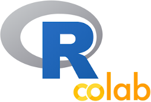

*Consultez et téléchargez les scripts utilisés dans le cadre des capsules de formation sous forme de documents Rmarkdown*

- Capsule préambule: L'environnement *Google Colab*

- Capsule 1: Entrée en matière - Qu'est-ce que R? 

- Capsule 2: Introduction au langage R (objets, fonctions et arguments)

- Capsule 3: L'Importation et l'exploration d'un tableau de données

- Capsule 4: L'indexation (sélection de variables et création de sous-groupes)

- Capsule 5: La manipulation de variables (renommer, recoder, agréger, ...)

- Capsule 6: Les statistiques descriptives

- Capsule 7: L'analyse et les tests statistiques de base

- Capsule 8: Les graphiques univariés et bivariés 

 > Ces capsules ont été développées et réalisées dans le cadre du cours en ligne **Introduction à la science des données sociales**, développé par le professeur [Éric Lacourse](https://socio.umontreal.ca/repertoire-departement/professeurs/professeur/in/in14715/sg/%C3%89ric%20Lacourse/), qui sera offert via la plateforme [EDUlib](https://catalogue.edulib.org/fr/institutions/umontreal/) de l'Université de Montréal à partir de janvier 2021.

